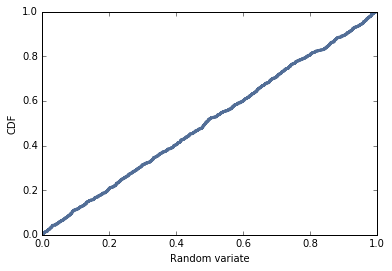

[Think Stats Chapter 4 Exercise 2](http://greenteapress.com/thinkstats2/html/thinkstats2005.html#toc41) (a random distribution)

>> sample = np.random.random(1000)  
>> pmf = thinkstats2.Pmf(sample)  
>> cdf = thinkstats2.Cdf(sample)  
>>
>> thinkplot.Pmf(pmf,linewidth=0.1)  
>> thinkplot.Config(xlabel='Random variate', ylabel='PMF')  
>>   
>> thinkplot.Cdf(cdf)  
>> thinkplot.Config(xlabel='Random variate', ylabel='CDF')  
>> 